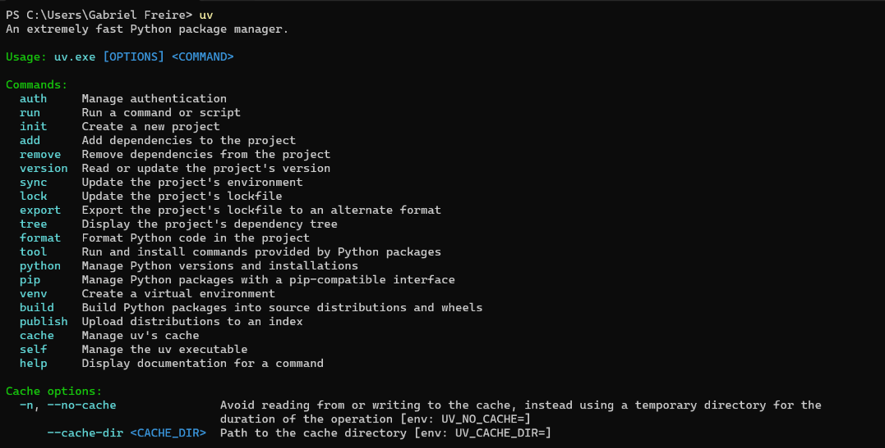
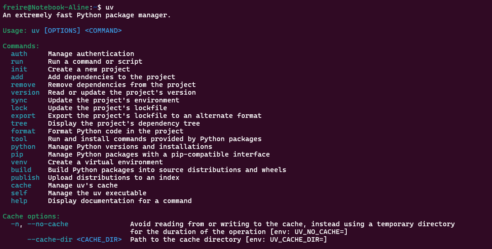
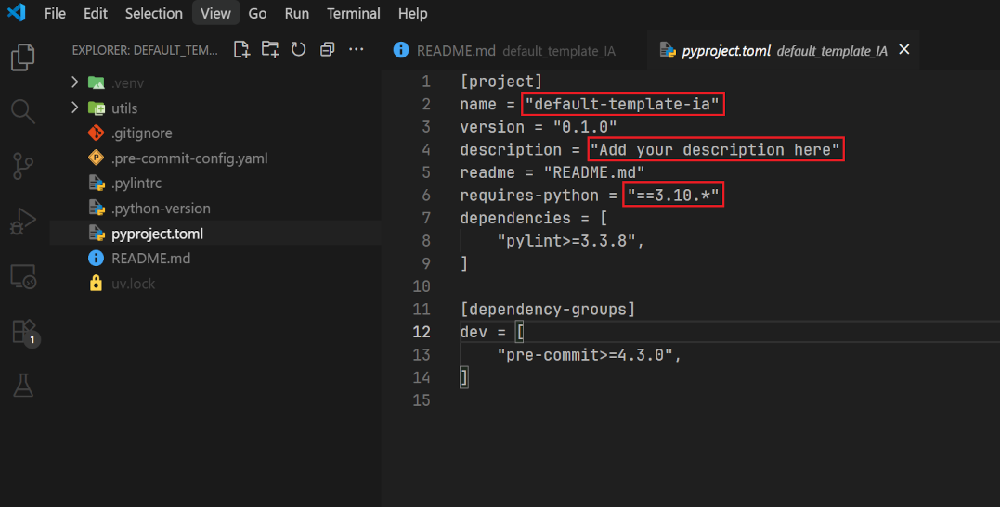

# Default Template - Steps to config your new Repository

## UV - install and configs steps

1. Install UV **(Only follow this if you haven't installed the UV yet)** 

    1.1. **(Windows)** Open a PowerShell terminal as administrator and run the follow command:
    ```sh
    powershell -c "irm https://astral.sh/uv/install.ps1 | iex"
    ```

    1.2. **(Linux)** Open a terminal and run the follow command:
    ```sh
    curl -LsSf https://astral.sh/uv/install.sh | sh
    ```

    1.3. Reload the terminal and test the UV:
    ```sh
    uv
    ```

    - 1.3.1. **(Windows)** The terminal will be something as:

        

    - 1.3.2. **(Linux)** The terminal will be something as:

        

    **Note:** If you already have the UV installed, skip to next session (2)

2. Configure the environment:

    2.1. Change the pyproject.toml informations for the new project informations:

    

    - `name`: Attribute a new name to your project. (**Note**: The project name also will be the environment's name)
    - `description` (optional): Add a short description about your project.
    - `requires-python`: The python version that your project needing.

    2.2. Setup the UV and pre-commit from the pyproject.toml:
    ```sh
    uv sync
    ```

    2.3. Active the virtual environment:

    - 2.3.1. Windows:
        ```sh
        .\.venv\Scripts\activate
        ```
    - 2.3.2. Linux:
        ```sh
        source ./.venv/bin/activate
        ```

    2.4. Run the follow commands to config the pre-commit (YOU ONLY NEED DOING THIS IN THE FIRST TIME):
    ```sh
    uv run pre-commit install
    uv run pre-commit install --hook-type commit-msg
    ```

    2.5. (**Optional**) deactivate the virtual environment:
    ```sh
    deactivate
    ```

3. UV util commands:

    3.1. Add a new dependencie:
    ```sh
    uv add DEPENDENCIE_NAME
    ```

    3.2. Remove a dependencie:
    ```sh
    uv remove DEPENDENCIE_NAME
    ```

    3.3. To list available and installed Python versions:
    ```sh
    uv python list
    ```

    3.3. Install a new python version (without use uv sync):
    ```sh
    uv python install VERSION
    ```
    - **NOTE**: Don't forget to update the python version on pyproject.toml if you want to use this version downloaded. 

    3.3. Run a script file:
    ```sh
    uv run SCRIPT_NAME.py
    ```

    **Note**: Use the 3.1. and 3.2. commands with the virtual environment activated!

## Commit Standardization - Examples:

We're using the Conventional Commits format, so a commit should follow the structure: `TYPE(SCOPE): SHORT_DESCRIPTION`

Where:

- **TYPE**: A brief word describing the purporse of the commit. Common types include:

    - `build`: Changes that affect the project’s build system or external dependencies.
    - `chore/config`: Changes in configuration or maintenance files that don’t affect the production code — for example, updates to .gitignore, package.json, etc.
    - `static`: Changes to static content such as .json data files, images, and other assets.
    - `cd`: Modifications to configuration files or scripts related to Continuous Delivery (CD).
    - `ci`: Modifications to configuration files or scripts related to Continuous Integration (CI).
    - `docs`: Documentation updates or additions.
    - `feat`: A new feature or functionality.
    - `fix`: A bug fix in the application.
    - `improve`: Code changes that enhance an existing feature’s behavior.
    - `perf`: Code changes that improve performance.
    - `refactor`: Code changes that neither fix a bug nor add a new feature — typically restructuring existing code.
    - `style`: Changes that do not affect the meaning of the code — e.g., whitespace, formatting, missing semicolons, etc.
    - `revert`: Reverts to a previous commit.
    - `test`: Adds missing tests or corrects existing ones.

- **SCOPE**: An optional section that indicates the area of the code affected
- **SHORT_DESCRIPTION**: An explanation of what the commit does (**the verbs needing be in the present**)

Example:

```scss
fix(inference): resolve error during model inference run
```

## Docs

[Pylint Documentation](https://pylint.org/#install)

[Pylint Article](https://www.rocketseat.com.br/blog/artigos/post/python-melhorando-a-qualidade-do-codigo-com-pylint)

[Pre-commit Documentation](https://pre-commit.com/)

[Commit Standardization](https://dev.to/asafedainez/entendendo-padronizacao-de-commits-conventional-commits-2fb9#:~:text=O%20que%20%C3%A9%20Padroniza%C3%A7%C3%A3o%20de,fluxo%20de%20trabalho%20do%20Git.&text=Como%20a%20frase%20acima%20prop%C3%B5e,%C3%A9%20do%20reposit%C3%B3rio%20da%20iniciativa.)

[UV Documentation](https://docs.astral.sh/uv/)